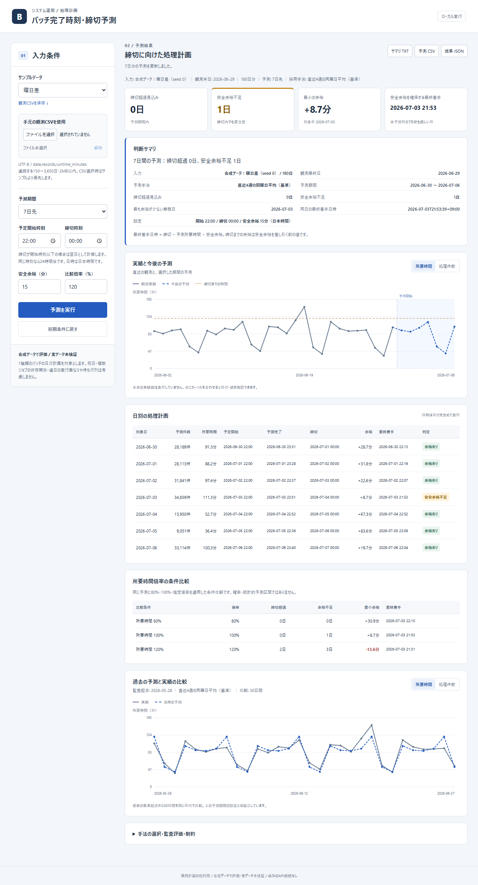

# バッチ完了時刻・締切予測

日次の処理件数と所要時間から、今後の**完了日時・締切超過・安全余裕を確保する最終着手日時**を確認するローカルアプリです。銀行システム運用の経験から着想したポートフォリオで、特定行の内部データ・仕様は含みません。

**合成データによる評価／実業務データでの有効性は未検証です。** 予測値を実績と比較でき、単純な同曜日平均が適している場合はその手法を採用します。アプリ実行時のAPIキー、LLM接続、従量課金、クラウド契約は不要です。



## 起動

Python 3.14で動作確認済み。PowerShellで実行します。

```powershell
cd C:\Users\morim\dev\batch-runtime-forecast
python -m venv .venv
.\.venv\Scripts\python -m pip install -r requirements.txt
.\.venv\Scripts\python run.py
```

[http://127.0.0.1:5001](http://127.0.0.1:5001) を開きます。初回の依存インストール後はオフラインで使用できます。既存のcapacity-forecastとは別リポジトリ・別ポートです。Flaskの開発サーバーをローカル専用で使用しています。

## 操作

1. 「曜日差」などのサンプルを選ぶか、過去の観測CSVを読み込みます。
2. 予測期間、予定開始・締切時刻、安全余裕を指定し「予測を実行」します。
3. 締切超過日数、最も余裕が少ない日、最終着手日時を確認します。日別表で各日の日時を確認できます。
4. 「過去の予測と実績の比較」で予測と実績のずれを確認します。
5. サマリTXT・予測CSV・結果JSONを保存します。

サンプル選択は**過去180日の入力データの切替**です。予測の増減を直接操作するものではありません。予測器にシナリオ名・生成式・未来の実績は渡しません。「比較倍率」は所要時間が仮に80%/100%/指定%になった場合の計画比較で、予測モデルや学習データを変更しません。確率の範囲や増設の効果でもありません。

[3分のデモ手順](docs/demo.md) / [初版仕様書](docs/specification.md) / [精度評価](docs/evaluation.md) / [監査記録](docs/audit.md)

## 入力

UTF-8のCSV、列は次の順序です。実際の入力には連続する150〜3650暦日が必要で、標準は半年=180点です。

```csv
date,records,runtime_minutes
2026-01-01,28700,91.3
2026-01-02,31500,99.2
```

- recordsは件数の非負整数、runtime_minutesは所要時間の分数。上限は10億件・10080分です。
- 件数や時間の減少、0件0分、0件で起動処理時間がある日を扱えます。
- 正の件数で時間0、欠損日、重複日、非数値、負値を拒否します。欠損を自動的に休止日と推定しません。
- ファイルは2MB以内。CSV選択中はサンプルより優先します。日付順に並べ直します。
- 未来の確定件数を入力する機能は初版にありません。件数から予測するため、その誤差も所要時間に含まれます。

## 期限の計算

業務日の予定開始から処理すると仮定します。締切時刻が開始時刻以下なら翌日です。同じ時刻なら24時間後です。

**最終着手日時 = 締切日時 − 予測所要時間 − 安全余裕**

例：7月3日の開始22:00、締切00:00、所要時間100分、安全余裕15分なら、締切は7月4日00:00、最終着手は7月3日22:05です。日本時間で日付を省略せず表示します。計画上の時間は秒に切り上げます。

## 評価の要点

設定と469ファイルのハッシュを最終評価前に固定し、6シナリオ×未使用20seed=120ケースを採点しました。各ケースは観測180点から未来30日を予測します。

| 所要時間MAE（分） | 1日先 | 7日間 | 30日間 |
|---|---:|---:|---:|
| 同曜日平均（基準） | 51.0 | 23.5 | 24.3 |
| 直近7日平均 | 43.1 | 38.5 | 39.9 |
| カレンダー付き回帰 | 23.3 | 20.8 | 22.0 |
| 開発区間で選択した手法 | 23.9 | 18.8 | 21.0 |

7日間の選択手法は基準比19.7%改善ですが、締切超過190件のうち48件を見逃し、64件の誤警報がありました。全ケースが同じ開始日を持ち、1日先が月末に当たるため、期間の長短を単純に比較できません。実務精度、全期間での優位性、警告の確実性を示す結果ではありません。

同曜日平均78ケース、7日平均1ケース、回帰41ケースを採用しました。突発増加の最悪ケースは7日MAE104.4分です。良い結果だけを選んでいません。[シナリオ別・全候補の結果](docs/evaluation.md)を参照してください。

## 検証・再現

```powershell
.\.venv\Scripts\python -m pip install -r requirements-dev.txt
.\.venv\Scripts\python -m pytest -q -p no:faulthandler
.\.venv\Scripts\python -m evaluation.benchmark --verify
.\.venv\Scripts\python tools/reproduce.py
```

38テスト＋102サブテスト、実ブラウザ18項目を確認しました。未来行の改変・追加で同一起点の予測/fit/選択が不変、標準化・再帰入力の時間境界、期限の手計算、上書き防止を含みます。対策とテストで確認した範囲を示すもので、未知のリークや過学習が存在しないという保証ではありません。

データ再生成（凍結済みの同梱データを変更しない例）：

```powershell
.\.venv\Scripts\python -m scripts.generate_demo --output .tmp-demo --scenario monthend --seed 0
```

ブラウザ検証は起動中のサーバーに対して実行します。初回にChromiumのインストールが必要です。

```powershell
.\.venv\Scripts\python -m playwright install chromium
.\.venv\Scripts\python tests/ui_check.py
```

最終採点は上書き防止のため、同梱結果がある状態で `--stage final` を再実行すると停止します。`tools/reproduce.py` は同じ凍結コードで値を再計算し、既存結果を変更せず照合するためのコマンドです。所要時間の計測値は実行環境で変わるので一致対象にしません。

## 構成・限界

- `forecasting/`：入力検証、3候補、日跨ぎの計画
- `evaluation/`：時系列分割、選択、全候補採点、固定プロトコル
- `app/`：Flask、業務UI、SVGグラフ、サマリ
- `data/demo/`：観測・未来の正解・生成メタデータを分離
- `docs/evaluation/`：凍結、ケース別CSV、予測値、探索/最終結果
- `tests/`：監査、API、ブラウザ検証

初版は1ジョブ・暦日を対象とし、祝日、依存ジョブ、並列実行、処理の重なり、待ち行列、実際の設備効果を扱いません。再帰予測の累積誤差、突発イベント、生成器への依存が残ります。実業務に進む際は匿名化した実績で期間を分け、見逃しのコストと許容誤差を定義して検証する必要があります。為替予測とLLM接続は含めません。

開発ではClaude Opusで仕様レビュー、Claude Sonnetでコードレビュー、GPT-6.1でUI・監査テストを分担しました。[判断記録](docs/design-decisions.md)に採否を残しています。アプリ自体にこれらのモデルへの接続はありません。
