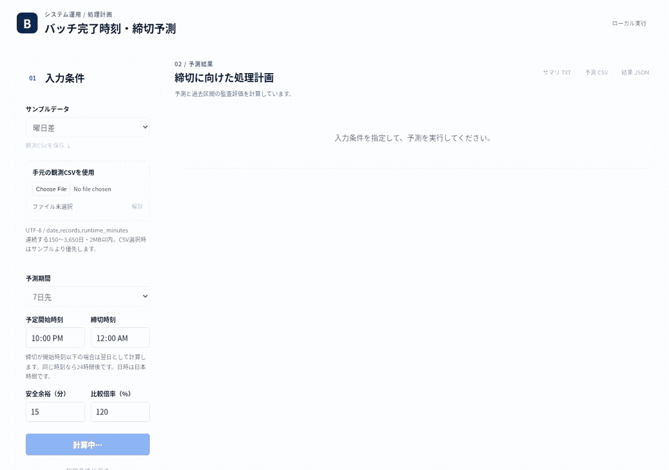

# デモ手順（約3分）

## 短い操作デモ

[操作動画を開く（MP4、約25秒）](images/batch-demo.mp4)

合成サンプルの7日予測から、入力変更 → 古い結果の保存停止 → 再計算 → 日別表の確認 → 過去の監査結果との比較 → サマリTXT保存までを録画しています。開始22:00・締切翌日00:00、安全余裕15分です。月末集中の結果を表示し、ダウンロードしたTXTに日付と締切が含まれることも確認しました。

動画は実際のローカルアプリ画面です。説明字幕だけを録画用ブラウザーに追加しています。アプリのソース・計算・出力は変更していません。公開ベンチマークの再評価や実業務の精度検証ではありません。

1. 起動して曜日差の7日予測を表示。過去180日の観測から件数と時間を推定することを説明する。「サンプル」は予測曲線の操作ではなく入力CSVの切替。
2. 予定開始22:00・締切00:00・安全余裕15分を確認。締切は翌日であること、超過0日でも安全余裕不足があり得ることを示す。
3. 最小余裕と同日の最終着手日時を確認。日別表の予定開始・予測完了・締切を照合する。
4. 月末集中へ切替えて実行。7日/30日、件数/所要時間を切替え、上下のある推移を示す。
5. 「過去の予測と実績の比較」を表示。これは未来の正解ではなく、観測180点のうち過去の監査区間を予測し直した結果。最新の監査起点から30日を同じ日付で並べる。
6. 評価詳細を開く。開発7日MAEでの選択、全候補の監査7/30日誤差、同曜日平均からの改善率を確認。UIの監査値とREADMEの未使用seedの最終ベンチマークは別の評価。
7. 倍率120%と80%を比較。資源増設効果や信頼区間とは言わず、所要時間が変わったという仮定の比較と説明。
8. TXT・CSV・JSONを保存。入力条件変更後に古い結果の保存が無効になることを確認。
9. 観測CSVを保存して、そのCSVをアップロード。「解除」でサンプルに戻せることを示す。

説明する限界：公開ベンチマークは合成データのみ。突発増加の予見、祝日やジョブ依存、待ち行列は対象外。締切超過の見逃しがあり、担当者の判断を置き換えるものとして評価していない。

## CSVの作成

`python -m scripts.generate_demo --output .tmp-demo --scenario burst --seed 3` で観測180点・採点用30点・メタデータを別々に作る。画面に入力するのは `observed/burst-3.csv` だけ。seed100〜119は今回の最終評価に使用済みなので、今後の開発で新しいホールドアウトとは扱わない。
